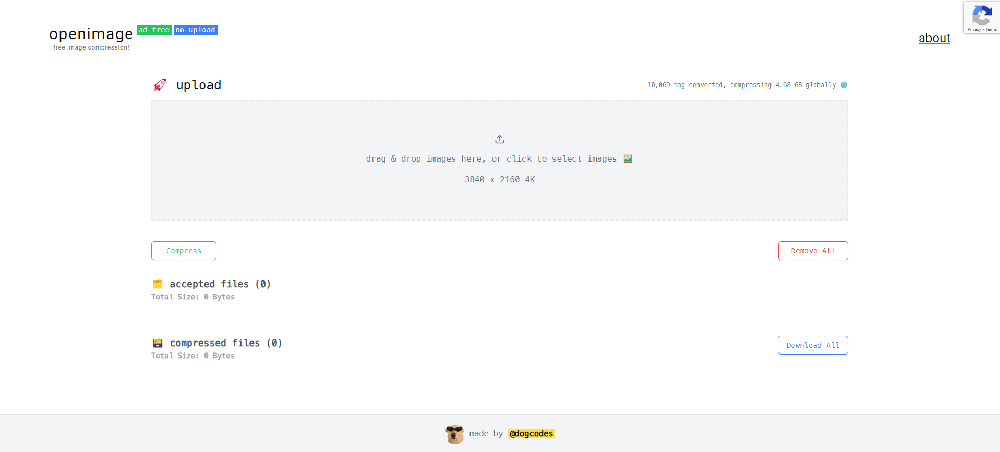

<h1 align="" id="title">openimage 🖼️</h1>

OpenImage: An open-source web application for bulk image compression. Efficiently optimize your images for faster loading times and improved web performance. Easy to use fast and convenient.

